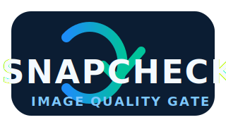

  

# TeleDerm SnapCheck
© 2025 Philip Shih. Released under the MIT License. 

Unless stated otherwise:
- **Ownership**: All original code in this repo is owned by Philip Shih.
- **Trademarks**: All product and company names are trademarks™ or registered® trademarks of their respective holders. Use does not imply endorsement.
- **Third-party content**: This project may reference or include third-party code or assets that are subject to their own licenses.
- **Contributions**: By submitting a contribution, you agree it’s your own work (or you have the right to submit it) and you license it under the repository’s license.

TeleDerm SnapCheck explores how automated dermatology image-quality gating impacts downstream teledermatology triage safety. Synthetic quality defects are applied to public datasets, and VLM performance is assessed with and without a calibrated ViT DIQA gate.

> **Latest paired-test result (1,344 exposures):** SnapCheck cuts urgent misses from 26.3 % to 8.2 % and raises urgent recall from 73.7 % to 76.6 %. The trade-off is a 14.5 % retake workload and 15.3 % urgent deferrals, covering 29 % of degraded inputs before clinician review (see `manuscript.md`).

## Getting Started

1. Create a virtual environment and install requirements.
2. Provide datasets in `/data` or run `scripts/download_public_datasets.py` to fetch ISIC/HAM10000 metadata.
3. Launch the synthetic image augmentation pipeline: `python scripts/build_quality_dataset.py --config configs/augmentation.yaml`.
4. Train the ViT classifier: `python scripts/train_quality_model.py --config configs/train_diqa.yaml`.
5. Run the triage simulation: `python scripts/run_triage_simulation.py --config configs/triage_eval.yaml`.
6. Regenerate tables/figures: `python scripts/analyze_triage_breakdowns.py` followed by `scripts/format_triage_publication_tables.py`.

Progress milestones and writing tasks are tracked in `docs/publication_plan.md`.

## In Progress

- Validation of SnapCheck on a fully external patient-generated cohort (e.g., SCIN/Path) to confirm safety gains outside HAM10000/Derm7pt synthetic pairs.
- Model performance comparisons: Gemini 2.5 Pro, GPT-5-20250807, Qwen3.
- Package reproducibility artifacts (model checksums, augmentation manifests, notebooks).

