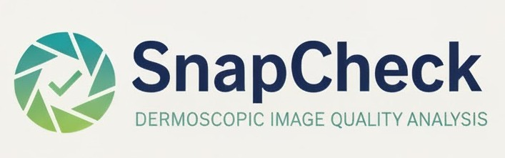

  

# TeleDerm SnapCheck
© 2025 Philip Shih. Released under the MIT License. 

Unless stated otherwise:
- **Ownership**: All original code in this repo is owned by Philip Shih.
- **Third-party content**: This project may reference or include third-party code or assets that are subject to their own licenses.
- **Contributions**: By submitting a contribution, you agree it’s your own work (or you have the right to submit it) and you license it under the repository’s license.

TeleDerm SnapCheck explores how automated dermatology image-quality gating impacts downstream teledermatology triage safety. Synthetic quality defects are applied to public dermoscopy datasets, and VLM performance is assessed with/without a calibrated ViT DIQA gate. This is the first study to demonstrate successful use of a DIQA gate for VLMs, assess efficiency tradeoff, and identify the type of image defect that most strongly impacts VLM triage performance.

> **Latest paired-test result (1,344 exposures):** SnapCheck cuts urgent miss rate of a VLM by 26.3 % to 8.2 % and raises urgent recall from 73.7 % to 76.6 %. The trade-off is a 14.5 % retake workload and 15.3 % urgent deferrals, covering 29 % of degraded inputs before clinician review (see `manuscript.md`).

We show that a ViT image quality gate reduces urgent miss rate by 69% (26.3%→8.2%) when set to reject 15% of images based on their degree of quality. This is done through a synthetic degradation pipeline and public skin image datasets. 
DIQA gating improved sensitivity for darker skin tones (Fitz VI +6.3 pts; MST 8–10 +5.4 pts) without increasing retake burden. Of all defect types, motion blur resulted in the highest retake burden. This may suggest interventions against camera movement are most important when preparing images for teledermatologic triage involving current VLM-based diagnostic systems.

## Getting Started

1. Create a virtual environment and install requirements.
2. Provide datasets in `/data` or run `scripts/download_public_datasets.py` to fetch ISIC/HAM10000 metadata.
3. Launch the synthetic image augmentation pipeline: `python scripts/build_quality_dataset.py --config configs/augmentation.yaml`.
4. Train the ViT classifier: `python scripts/train_quality_model.py --config configs/train_diqa.yaml`.
5. Run the triage simulation: `python scripts/run_triage_simulation.py --config configs/triage_eval.yaml`.
6. Regenerate tables/figures: `python scripts/analyze_triage_breakdowns.py` followed by `scripts/format_triage_publication_tables.py`.

Milestones and writing tasks tracked in `docs/publication_plan.md`.

## In Progress

- Validation on external teledermatology cohorts
- VLM model performance comparisons
- Package reproducibility artifacts
