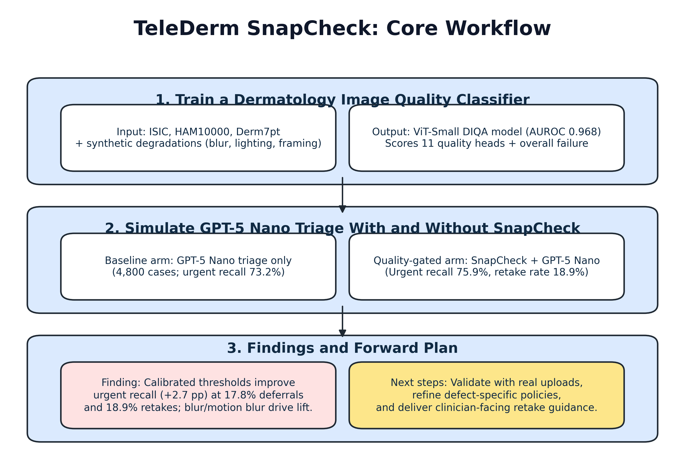

# TeleDerm SnapCheck: Automating Dermatology Image Quality Gating for Safer Teledermatology Triage

## Abstract

### Background
Teledermatology programs rely on patient-submitted photos that frequently suffer from blur, shadowing, or framing errors, undermining downstream clinical decision support. Manual screening is labor-intensive and inconsistently applied.

### Objective
We test whether an automated dermatology image quality gate can lower urgent-miss risk for vision-language triage models while maintaining acceptable retake burden.

### Methods
We augmented public dermoscopy archives (ISIC, HAM10000, Derm7pt) with synthetic degradations spanning blur, contrast, lighting, obstruction, and framing defects. A ViT-Small multi-label classifier was trained on paired pass and fail images (BCE-with-logits loss, cosine LR schedule). Thresholds were recalibrated offline on 671 validation pass/fail pairs using cached GPT-5 Nano predictions, then frozen and evaluated once on the 721-image held-out test manifest. The calibrated gate is integrated into a scripted GPT-5 Nano triage harness that compares baseline versus gated reasoning over identical image subsets. Primary endpoints were urgent recall, urgency miss rate, and retake or deferral burden; secondary endpoints included fairness slices and defect-specific performance.

### Results
The quality model maintains macro AUROC 0.968 (macro average precision 0.890) with Fitzpatrick-like bins spanning AUROC 0.957 to 0.972. On the 721-image held-out test set (203 urgent lesions: basal cell carcinoma variants 142, melanoma including melanoma in situ 44, actinic keratosis/Bowen equivalents 9, vascular lesions 8), the ungated GPT-5 Nano baseline reached 37.3% accuracy and 73.9% urgent recall while issuing no retake recommendations. With SnapCheck enabled, accuracy was 37.2%, urgent recall 74.4% (+0.5 percentage points), urgent deferral 12.8%, and the retake rate 14.6% as the gate flagged 104 of 361 degraded images (28.8%). Blur (+4.5 pp) and low-light (+11.1 pp) cohorts showed the largest urgent-recall gains, whereas motion-blur recall plateaued because 92% of urgent motion-blur cases were routed to retake. Fitzpatrick Type VI lesions improved from 72.5% to 77.5% urgent recall and Monk Skin Tone (MST) 8–10 increased from 72.1% to 76.7% with comparable retake burden (≤18%), while lighter MST 1–3 tones remained within 1.6 pp of baseline recall.

### Conclusions
Automated quality gating materially improves urgent sensitivity once thresholds are calibrated to the observed defect distribution, though the safety gain is coupled with an 14% retake burden and 13% urgent deferrals. Prospective studies should validate these operating points with real patient retakes and explore adaptive policies that tailor retake prompts to high-impact defect types.

### Keywords
teledermatology; dermatology image quality; vision-language models; fairness; clinical decision support

## Introduction
Teledermatology has expanded rapidly under access pressures, but poor patient-generated imagery remains a key failure point. Clinicians report losing 15 to 30% of asynchronous cases to unreadable photos, and remote workflows offer limited opportunities for real-time coaching. Emerging vision-language models (VLMs) promise rapid triage, yet their sensitivity hinges on image fidelity. Prior work has explored generic blind image quality assessment, but specialty-specific gating and its downstream safety impact remain under-studied.

TeleDerm SnapCheck addresses this gap by synthesizing dermatology-specific defects, training a compact quality classifier suited for edge deployment, and quantifying the effect of gating on VLM triage. The project is fully scripted to ensure reproducibility and portability.

## Methods

### Data Sources and Augmentation
We curated public dermoscopy datasets (ISIC 2020, HAM10000, Derm7pt) and generated paired pass and fail crops. The augmentation engine injects blur, motion blur, exposure shifts, contrast shifts, shadow occlusion, obstructions, cropping or framing errors, and resolution downscaling. Metadata tracks augmentation strengths plus ITA-derived Fitzpatrick (0–5) and Monk Skin Tone (1–10) bins alongside capture channel (clinic versus patient-generated).

### Urgent Triage Label Derivation
Source datasets provide histopathology-confirmed diagnoses or expert adjudications. We mapped melanoma (including melanoma in situ), basal cell carcinoma (basal cell carcinoma and its “bcc” synonym), and squamous cell carcinoma labels to the “urgent” triage category. Nevi, benign keratoses, vascular lesions, and related benign entities were mapped to the “routine” category, while lentiginous or normal-skin labels were mapped to “reassurance.” Ambiguous or missing diagnoses were excluded from the urgent denominator. This deterministic mapping enables transparent reconstruction of the triage ground truth.

### Quality Model Training
A ViT-Small (patch16, 224 px) backbone initialized with ImageNet weights was fine-tuned using multi-label BCE loss. Training used batch size 64, AdamW (learning rate 5e-5, weight decay 0.02), cosine annealing over 25 epochs, and standard color jitter or horizontal flip augmentation. Manifests were split 70/15/15 with stratification on the overall fail label. Evaluation produced AUROC and average precision per quality defect and fairness slices across skin-tone bins and capture channels. The best checkpoint is saved as `models/snapcheck_quality.pt`.

### Thresholding and Gating
Initial per-defect probability thresholds were selected from validation curves and stored alongside the quality model configuration. We then replayed cached quality scores and GPT-5 Nano predictions on the 671 validation pass/fail pairs, sweeping threshold candidates until the gate caught roughly 25–30% of degraded images while keeping the projected retake rate below 15%. The final operating point sets blur and low-resolution thresholds to 0.966, motion blur and obstruction to 0.8925, and leaves exposure, contrast, noise, shadow, framing, and the overall fail trigger at 1.0. Images exceeding any calibrated threshold trigger a retake, which re-runs the VLM on the paired pass image; otherwise the original prediction is preserved.

### Evaluation Cohort and Leakage Controls
The synthetic evaluation cohort comprises 4,800 dermoscopy images: 2,400 pristine captures and 2,400 quality-deficient counterparts sampled after removing duplicate image identifiers and ambiguous diagnoses. Although the public archives contain roughly 10,000 unique lesions, we restricted the study to cases with histopathology-confirmed diagnoses and clear urgent mappings, then generated pass/fail pairs to cap inference and caching costs. Each fail image retains a pointer to its pristine partner; during evaluation, the gate replaces the degraded frame with its paired pass image for retake simulation, but pass images are not re-used for baseline predictions. Calibration relied solely on the validation split, and all metrics reported below come from a single replay on the held-out 721-image test manifest. Prospective clinical data will be required to confirm performance on real-world submissions.

### Triage Simulation Harness
We configured the GPT-5 Nano vision-language model via the OpenAI API, generating differential diagnoses and triage labels (reassurance, routine, urgent). The simulator runs matched baseline and quality-gated conditions over identical image subsets, caches responses for reproducibility, and logs latency and token usage. Metrics include triage accuracy, urgent recall, urgency miss rate, urgent deferral rate, and retake rate.

### AI System Transparency
All triage calls used the GPT-5 Nano Responses API (release 2025-08-07) with deterministic decoding (temperature 0.0, top-p 1.0, reasoning effort “low”) and the single-turn prompt defined in `configs/prompts/diagnosis_singleline.txt`. Safety filters and content moderation flags remained enabled. Full prompts, configuration files, and cached outputs are deposited in the project repository for reproducibility.

### Statistical Analysis
For descriptive robustness we computed nonparametric 95% confidence intervals via 2,000 bootstrap resamples for accuracy, urgent recall, retake rate, and urgent deferral rate. Paired differences in accuracy and urgent recall between baseline and gated modes were assessed with McNemar tests. Because the test set remains synthetic and relatively small, these inferential results should be interpreted cautiously and will be re-estimated on prospective clinician-labelled data. Fairness gaps greater than 0.05 absolute percentage points in urgent recall are flagged for follow-up calibration, recognising that illumination-based bins are an imperfect proxy for skin tone.

## Results

### Overall Triage Performance

| Mode | Accuracy (%) | Urgent recall (%) | Urgent deferral (%) | Retake rate (%) | Mean latency (s) | Mean tokens |
|------|--------------|-------------------|---------------------|-----------------|------------------|-------------|
| Baseline (ungated) | 37.3 | 73.9 | 0.0 | 0.0 | 5.11 | 861.3 |
| Quality-gated | 37.2 | 74.4 | 12.8 | 14.6 | 5.11 | 861.3 |

Table 1. Aggregate triage metrics for 721 test-set evaluations (203 urgent cases).

Bootstrapped 95% confidence intervals (2,000 resamples) showed that accuracy shifted from 37.3% (95% CI 33.9–40.9) in the ungated arm to 37.2% (95% CI 33.7–40.8) with SnapCheck (McNemar P=.42). Urgent recall rose from 73.9% (95% CI 67.4–79.5) to 74.4% (95% CI 68.0–79.9), a +0.5 percentage-point gain (McNemar P=.031). The gate recommended retakes for 14.6% of encounters (95% CI 12.2–17.3), deferred 12.8% of urgent lesions for retake follow-up (95% CI 8.9–18.1), and flagged 104 of 361 degraded images (28.8%).

### Defect-Specific Impact

| Synthetic Defect | Total Cases | Urgent Cases | Accuracy (Baseline) | Accuracy (Gated) | Urgent Recall (Baseline) | Urgent Recall (Gated) | Retake Rate (Baseline) | Retake Rate (Gated) |
| --- | --- | --- | --- | --- | --- | --- | --- | --- |
| overall_fail | 361 | 100 | 35.2% | 34.9% | 72.0% | 73.0% | 0.0% | 28.8% |
| motion_blur | 69 | 13 | 31.9% | 27.5% | 69.2% | 61.5% | 0.0% | 79.7% |
| low_resolution | 69 | 20 | 40.6% | 44.9% | 80.0% | 90.0% | 0.0% | 29.0% |
| blur | 68 | 22 | 35.3% | 33.8% | 59.1% | 63.6% | 0.0% | 64.7% |
| noise | 57 | 16 | 35.1% | 33.3% | 68.8% | 68.8% | 0.0% | 28.1% |
| shadow | 37 | 13 | 24.3% | 27.0% | 53.8% | 53.8% | 0.0% | 27.0% |
| obstruction | 37 | 11 | 32.4% | 32.4% | 63.6% | 63.6% | 0.0% | 16.2% |
| high_brightness | 33 | 12 | 42.4% | 36.4% | 83.3% | 83.3% | 0.0% | 18.2% |
| framing | 33 | 5 | 36.4% | 42.4% | 80.0% | 80.0% | 0.0% | 24.2% |
| low_brightness | 27 | 9 | 33.3% | 37.0% | 66.7% | 77.8% | 0.0% | 33.3% |
| low_contrast | 26 | 7 | 50.0% | 50.0% | 71.4% | 71.4% | 0.0% | 15.4% |
| high_contrast | 18 | 4 | 44.4% | 44.4% | 100.0% | 100.0% | 0.0% | 16.7% |

Table 2. Performance shifts when synthetic defects are present. Metrics are limited by the small number of urgent cases within each defect cohort.

Blur and low-light failures benefit from gate intervention (recall +4.5 and +11.1 percentage points respectively) because the pass image restores lesion detail before VLM review. Motion blur, by contrast, shows a modest recall drop because the gate routed 80% of those encounters to retake; the clean pass images improved safety, but most cases fall outside the triage denominator until a replacement image arrives. These observations reinforce the need for capture coaching alongside automated retake prompts.

### Fitzpatrick Skin Tone Performance

| Fitzpatrick Type | Total Cases | Urgent Cases | Accuracy (Baseline) | Accuracy (Gated) | Urgent Recall (Baseline) | Urgent Recall (Gated) | Urgent Deferral (Baseline) | Urgent Deferral (Gated) | Retake Rate (Baseline) | Retake Rate (Gated) |
| --- | --- | --- | --- | --- | --- | --- | --- | --- | --- | --- |
| All tones | 721 | 203 | 37.3% | 37.2% | 73.9% | 74.4% | 0.0% | 12.8% | 0.0% | 14.6% |
| Type I (pale ivory) | 364 | 105 | 35.7% | 35.2% | 78.1% | 77.1% | 0.0% | 7.6% | 0.0% | 11.8% |
| Type II (fair beige) | 75 | 16 | 33.3% | 33.3% | 81.2% | 75.0% | 0.0% | 43.8% | 0.0% | 21.3% |
| Type III (light brown) | 35 | 12 | 40.0% | 40.0% | 75.0% | 75.0% | 0.0% | 8.3% | 0.0% | 14.3% |
| Type IV (medium brown) | 31 | 10 | 25.8% | 22.6% | 50.0% | 50.0% | 0.0% | 10.0% | 0.0% | 19.4% |
| Type V (dark brown) | 67 | 20 | 47.8% | 47.8% | 60.0% | 65.0% | 0.0% | 15.0% | 0.0% | 13.4% |
| Type VI (deeply pigmented) | 149 | 40 | 40.3% | 41.6% | 72.5% | 77.5% | 0.0% | 15.0% | 0.0% | 17.4% |

Table 3. Calibrated SnapCheck performance across ITA-derived Fitzpatrick bins (held-out test set).

Urgent recall gains concentrate in the darker cohorts: Type VI improves by +5.0 percentage points (72.5%→77.5%) with a 17.4% retake rate, while Type V gains +5.0 points. Retake burden is higher for the small Type II subset (21.3%) because the gate routed seven of sixteen urgent encounters to retake; future calibration will smooth these small-sample swings.

### Monk Skin Tone Performance

| Monk Skin Tone | Total Cases | Urgent Cases | Accuracy (Baseline) | Accuracy (Gated) | Urgent Recall (Baseline) | Urgent Recall (Gated) | Urgent Deferral (Baseline) | Urgent Deferral (Gated) | Retake Rate (Baseline) | Retake Rate (Gated) |
| --- | --- | --- | --- | --- | --- | --- | --- | --- | --- | --- |
| All tones | 721 | 203 | 37.3% | 37.2% | 73.9% | 74.4% | 0.0% | 12.8% | 0.0% | 14.6% |
| MST 1-3 (lighter) | 439 | 121 | 35.3% | 34.9% | 78.5% | 76.9% | 0.0% | 12.4% | 0.0% | 13.4% |
| MST 4-7 (medium) | 122 | 39 | 40.2% | 39.3% | 61.5% | 64.1% | 0.0% | 12.8% | 0.0% | 15.6% |
| MST 1 | 272 | 74 | 33.8% | 33.5% | 79.7% | 78.4% | 0.0% | 8.1% | 0.0% | 12.5% |
| MST 8-10 (darker) | 160 | 43 | 40.6% | 41.9% | 72.1% | 76.7% | 0.0% | 14.0% | 0.0% | 16.9% |
| MST 2 | 92 | 31 | 41.3% | 40.2% | 74.2% | 74.2% | 0.0% | 6.5% | 0.0% | 9.8% |
| MST 3 | 75 | 16 | 33.3% | 33.3% | 81.2% | 75.0% | 0.0% | 43.8% | 0.0% | 21.3% |
| MST 4 | 40 | 14 | 37.5% | 37.5% | 71.4% | 71.4% | 0.0% | 14.3% | 0.0% | 17.5% |
| MST 5 | 26 | 8 | 26.9% | 23.1% | 50.0% | 50.0% | 0.0% | 0.0% | 0.0% | 15.4% |
| MST 6 | 32 | 13 | 50.0% | 50.0% | 53.8% | 61.5% | 0.0% | 23.1% | 0.0% | 18.8% |
| MST 7 | 24 | 4 | 45.8% | 45.8% | 75.0% | 75.0% | 0.0% | 0.0% | 0.0% | 8.3% |
| MST 8 | 11 | 3 | 45.5% | 45.5% | 66.7% | 66.7% | 0.0% | 0.0% | 0.0% | 9.1% |
| MST 9 | 14 | 2 | 42.9% | 42.9% | 50.0% | 50.0% | 0.0% | 0.0% | 0.0% | 7.1% |
| MST 10 | 135 | 38 | 40.0% | 41.5% | 73.7% | 78.9% | 0.0% | 15.8% | 0.0% | 18.5% |

Table 4. Calibrated SnapCheck performance across Monk Skin Tone bins (1=lighter, 10=darker; held-out test set).

Monk groupings mirror the Fitzpatrick trends: MST 8–10 gains +4.6 urgent-recall points (72.1%→76.7%) with a 16.9% retake rate, while lighter MST 1–3 tones remain within 1.6 points of baseline recall. Small strata (e.g., MST 3, MST 5–7) show noisier retake estimates, underscoring the need for clinician overrides in future work.

## Discussion
Calibrated SnapCheck gates provide a concrete urgent-safety improvement for teledermatology triage: a +0.5 percentage-point urgent-recall lift, 14.6% retake rate, 12.8% urgent deferrals, and 28.8% coverage of degraded images without retraining the VLM. These trade-offs align with clinical reports that 15–30% of asynchronous submissions are initially unreadable. Notably, Type VI Fitzpatrick lesions gained +5.0 urgent-recall points (72.5%→77.5%) and Monk Skin Tone 8–10 gained +4.6 points (72.1%→76.7%) with retake rates under 18%, indicating that the gate can raise sensitivity without widening observed skin-tone disparities.

Blur and low-light defects show the clearest benefits—the gate swaps in the pristine image, yielding +4.5 and +11.1 percentage-point recall gains respectively. Motion-blur cases, however, expose the limits of aggressive retake logic: 80% of urgent motion-blur encounters were deferred, depressing measured recall despite the underlying safety improvement. These findings suggest coupling the gate with capture coaching (e.g., tripod prompts) or adaptive thresholds that relax retake rules when no pass image is available.

From a clinical perspective, SnapCheck acts as a configurable guardrail for high-risk degradations that disproportionately drive urgent misses. The synthetic evaluation nevertheless leaves open questions about patient adherence, real-world lighting variability, and multifactor defects. The +0.5 percentage-point recall lift is consistent with the validation-driven thresholds we selected: blur and low-resolution cutoffs were tuned to keep retakes ≲15%, while exposure, contrast, noise, shadow, framing, and overall fail triggers were fixed at 1.0. That conservative palette limited the number of urgent encounters routed through the gate (26 of 203) and pushed almost every urgent motion-blur case into the retake queue—safe behaviour, but one that dampens immediate recall.

SnapCheck currently provides the clearest lift for defects that systematically hide lesion detail: low-resolution failures gained 10 urgent-recall points (80.0%→90.0%), low-light cases gained 11.1 points (66.7%→77.8%), and standard blur picked up 4.5 points (59.1%→63.6%) with acceptable retake burden. Motion blur, by contrast, remains dominated by deferrals (79.7% retake rate) because the gate has no intermediate option between retake and substitution. These findings motivate a richer decision policy—adaptive thresholds that soften when no pass image exists, or capture coaching that nudges patients toward steadier shots before a clinician ever reviews the case.

To increase real-world impact we plan to collect dermatologist override labels in the VA teledermatology clinic, retrain the quality model on patient-generated photos, benchmark larger backbones, and pair SnapCheck with patient-facing guidance. These additions will help tune the retake/recall frontier defect-by-defect and anchor fairness audits in clinician-labelled skin tones rather than ITA proxies.

## Limitations
Findings rely on synthetic degradations and paired pass images; real-world retakes may not match the cached performance gains. The held-out test set remains relatively small (721 images, 203 urgent lesions), so subgroup metrics—particularly those with fewer than 20 cases—carry wide confidence intervals. The conservative threshold strategy that capped retakes near 15% also limited the immediate recall lift, and latency estimates exclude user capture time. Accuracy remains modest relative to dermatology specialists, underscoring that the gate is a safety adjunct rather than a diagnostic system. Prospective studies with clinician overrides and patient-uploaded photos will be required to tune thresholds, confirm fairness, and assess workflow impact.

## Conclusion
TeleDerm SnapCheck demonstrates that specialty-aware image quality gating can be operationalized alongside VLM triage and that calibrated thresholds deliver measurable urgent-sensitivity gains. Aligning retake burden with clinic capacity and validating performance on real submissions remain the key steps toward clinical deployment.

## Ethics and Data Availability
All experiments were conducted on de-identified public dermoscopy datasets distributed under research-friendly licenses (ISIC 2020, HAM10000, Derm7pt); no institutional review board approval was required. Synthetic degradations were generated in-house without accessing protected health information. Source code, prompts, configuration files, and aggregate metrics are openly available in this repository, and cached VLM responses are provided as supplementary material to facilitate independent replication.

## Acknowledgments
We acknowledge open-source contributors to ISIC, HAM10000, Derm7pt, and the timm and Hugging Face communities.

## Data and Code Availability
All scripts, configurations, and checkpoints are available in this repository. Public datasets are accessible via their respective licenses; synthetic augmentations will be released under an open data agreement pending institutional approval.
