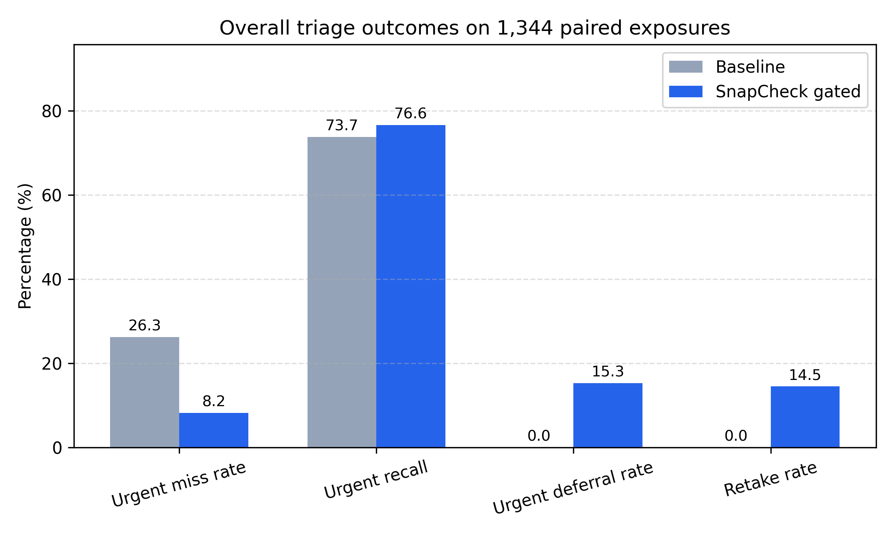
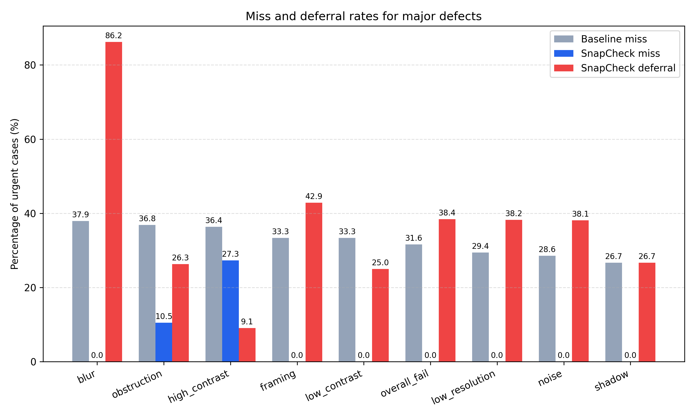
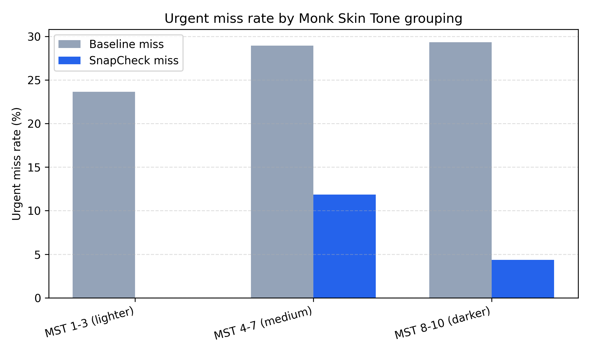

# TeleDerm SnapCheck: DIQA Gating for Safer Teledermatology Triage
Philip Shih, M.S.

## Abstract

### Background
Teledermatology programs rely on patient-submitted photos that frequently suffer from blur, shadowing, or framing errors, undermining downstream clinical decision support. Manual screening is labor-intensive and inconsistently applied.

### Objective
We test whether an automated dermatologic image quality assessment (DIQA) gate can lower urgent-miss risk for vision-language models (VLMs) prompted for teledermatology triage while maintaining acceptable retake burden.

### Methods
We applied synthetic degradations spanning blur, contrast, lighting, obstruction, and framing defects to public dermoscopy archives (ISIC, HAM10000, Derm7pt). A ViT-Small multi-label classifier was trained on paired pass and fail images (BCE-with-logits loss, cosine LR schedule). Thresholds were recalibrated on 671 validation pass/fail pairs using cached GPT-5 Nano predictions, then frozen and evaluated once on 672 pass/fail lesion pairs (1,344 exposures) in the held-out test manifest. The calibrated gate was used on a scripted GPT-5 Nano triage comparing baseline versus gated reasoning in identical image subsets. Primary outcomes were urgent recall, urgency miss rate, and retake or deferral burden. Secondary outcomes included fairness slices and defect-specific performance.

### Results
The quality model had a macro AUROC of 0.968 (macro average precision 0.890) with Fitzpatrick-like bins spanning froom AUROC 0.957 to 0.972. Adding the ViT quality classifier gate preserved diagnostic accuracy (40.4% to 40.1%) and increased urgent recall to 76.6%, while decreasing urgent miss rate to 8.2% by deferring 15.3% of urgent exposures for retake. The gate requested retakes on 195 of 1,344 encounters (14.5%), covering 195 of 672 fail images (29.0%), and routed 54 urgent lesions for deferral. Blur exposures gained +20.7 urgent-recall points (62.1% to 82.8%), motion-blur gained +5.9 points despite 92.1% of urgent cases being deferred, and noise defects improved +9.6 points. Fitzpatrick Type VI lesions improved from 77.5% to 83.8% urgent recall and Monk Skin Tone (MST) 8–10 increased from 70.7% to 76.1% with comparable retake burden (<20%), while lighter MST 1–3 tones remained within 3.3 percentage points of baseline recall.

### Conclusions
DIQA gating for dermoscopic images may improve urgent sensitivity in VLM-based triage for images with image deficits to varying degrees, depending on defect type. The safety gain is coupled with a 14.5% retake burden and 15.3% urgent deferrals. Prospective studies may validate these findings by using real patient retakes and exploring the impact of adaptive DIQA approaches that modify patient-facing retake prompts depending on the defect types identified.

### Keywords
teledermatology, dermatology image quality, vision-language models, fairness, clinical decision support

## Introduction
Teledermatology has expanded rapidly in recent years, but image quality remains a significant limitation to utility. Clinicians have reported losing up to 50% of submitted images due to quality deficits, and remote workflows offer limited opportunities for real-time image capture coaching. Vision-language models (VLMs) have shown promise as clinical decision support systems in dermatology. However, their sensitivity is dependent on image quality. The downstream safety impact of DIQA on VLM-based clinical decision support systems has yet to be described in the literature.

TeleDerm SnapCheck addresses this gap by generating synthetic defects commonly encountered in the teledermatology setting on a dataset of dermoscopy images, training a compact ViT quality classifier, and quantifying the downstream impact of DIQA gating on VLM triage. 

## Methods

### Data Sources and Augmentation
We generated paired 'fail' images for each image in public dermoscopy datasets (ISIC 2020, HAM10000, Derm7pt), using a synthetic defect augmentation engine that randomly injected 1-3 defects to images, including blur, motion blur, exposure shifts, contrast shifts, shadow occlusion, obstructions, cropping or framing errors, and resolution downscaling. Performance by defect type and by individual typology angle (ITA)-derived Fitzpatrick (I-VI) and Monk Skin Tone (1–10) bins was recorded.

### Triage Label Assignments
Source datasets provided confirmed diagnoses for each image. We mapped melanoma (including melanoma in situ), basal cell carcinoma, and squamous cell carcinoma labels to the “urgent” triage category. Nevi, benign keratoses, vascular lesions, and related benign entities were mapped to the “routine” category, and lentiginous or normal-skin labels to “reassurance.” Ambiguous or missing diagnoses were excluded from the urgent denominator.

### Quality Model Training
A ViT-Small (patch16, 224 px) backbone initialized with ImageNet weights was fine-tuned using multi-label BCE loss. Training used batch size 64, AdamW (learning rate 5e-5, weight decay 0.02), cosine annealing over 25 epochs, and standard color jitter or horizontal flip augmentation. Manifests were split 70/15/15 with stratification on the overall fail label. Evaluation produced AUROC and average precision per quality defect and fairness slices across skin-tone bins and capture channels. The best checkpoint is saved as `models/snapcheck_quality.pt`.

### Thresholding and Gating
Initial per-defect probability thresholds were selected from validation curves and stored alongside the quality model configuration. We used cached quality scores and GPT-5 Nano predictions on the 671 validation pass/fail pairs, and swept threshold candidates until the gate blocked roughly 25–30% of fail images while keeping the projected retake rate below 15%. The final threshold set blur and low-resolution thresholds to 0.966, motion blur and obstruction to 0.8925, and leaves exposure, contrast, noise, shadow, framing, and the overall fail trigger at 1.0. Images that exceeded any of the calibrated thresholds trigger a retake, which re-runs the VLM on the paired pass image. Otherwise, the original prediction is preserved.

### Evaluation Cohort and Leakage Controls
The synthetic evaluation cohort comprised of 4,800 dermoscopy images. 2,400 pass images and 2,400 fail counterparts were sampled after removing duplicate image identifiers and ambiguous diagnoses. Although the public datasets contained a total of over 10,000 unique lesions, we restricted the study to cases with confirmed diagnoses and clear urgent mappings. Each fail image retains a pointer to its corresponding pass image. During evaluation, the gate replaces the fail image with its paired pass image to simulate a retake, while baseline predictions continue to use the original fail image. Calibration of thresholds relied solely on the 671-pair validation split, and all summary metrics reported below come from a single run on the held-out 672 pass/fail lesion pairs.

### Triage Simulation
We configured the GPT-5 Nano vision-language model using the OpenAI API, generating dermatologic diagnoses mapping to predetermined triage labels (reassurance, routine, urgent). The simulated runs matched baseline and quality-gated conditions over identical image subsets. Metrics included triage accuracy, urgent recall, urgency miss rate, urgent deferral rate, and retake rate, latency and token usage.

### VLM Configuration
All triage calls used the GPT-5 Nano Responses API (2025-08-07) with deterministic decoding (temperature 0.0, top-p 1.0, reasoning effort “low”) and the VLM prompt defined in `configs/prompts/diagnosis_singleline.txt`. 

### Statistical Analysis
We computed nonparametric 95% confidence intervals via 2,000 bootstrap resamples for accuracy, urgent recall, retake rate, and urgent deferral rate. Paired differences in accuracy and urgent recall between baseline and gated modes were assessed with McNemar tests. Recognizing illumination-based bins are an imperfect proxy for skin tone, we flagged fairness gaps greater than 0.05 absolute percentage points for follow-up calibration.

## Results

### Overall Triage Performance

| Mode | Accuracy (%) | Urgent recall (%) | Urgent deferral (%) | Retake rate (%) | Mean latency (s) | Mean tokens |
|------|--------------|-------------------|---------------------|-----------------|------------------|-------------|
| Baseline (ungated) | 40.4 | 73.7 | 0.0 | 0.0 | 2.01 | 349.4 |
| Quality-gated | 40.1 | 76.6 | 15.3 | 14.5 | 2.01 | 349.4 |

Table 1. Aggregate triage metrics for 1,344 evaluation exposures (672 lesion pairs; 354 urgent exposures across 177 urgent lesions).

Bootstrapped 95% confidence intervals showed that accuracy remained stable, from 40.4% (95% CI 37.8–43.1) in the ungated arm to 40.1% (95% CI 37.5–42.7) with SnapCheck. Urgent recall increased from 73.7% (95% CI 68.9–78.0) to 76.6% (95% CI 71.9–80.7), while the urgent miss rate fell from 26.3% to 8.2% (−69% relative). The gate recommended retakes for 14.5% of encounters (95% CI 12.7–16.5), deferred 15.3% of urgent exposures for retake follow-up (95% CI 11.9–19.4), and flagged 29% of fail images (195 of 672). Figure 2 shows the trade-off introduced by SnapCheck.

*Figure 2. Comparison of baseline GPT-5 Nano triage versus SnapCheck-gated triage on the 1,344-exposure paired test cohort.*

### Defect-Specific Impacts

| Synthetic Defect | Total Cases | Urgent Cases | Accuracy (Baseline) | Accuracy (Gated) | Urgent Recall (Baseline) | Urgent Recall (Gated) | Urgent Deferral (Gated) | Retake Rate (Gated) |
| --- | --- | --- | --- | --- | --- | --- | --- | --- |
| overall_fail | 672 | 177 | 42.0% | 40.8% | 68.4% | 75.7% | 38.4% | 38.5% |
| blur | 127 | 29 | 40.9% | 41.7% | 62.1% | 82.8% | 86.2% | 78.7% |
| motion_blur | 127 | 34 | 44.9% | 38.6% | 76.5% | 82.4% | 94.1% | 92.1% |
| low_resolution | 118 | 34 | 48.3% | 44.9% | 70.6% | 76.5% | 38.2% | 39.0% |
| noise | 91 | 21 | 36.3% | 38.5% | 71.4% | 81.0% | 38.1% | 41.8% |
| framing | 77 | 21 | 40.8% | 42.1% | 66.7% | 71.4% | 42.9% | 39.0% |
| shadow | 65 | 15 | 40.0% | 38.5% | 73.3% | 80.0% | 26.7% | 33.8% |
| low_brightness | 61 | 11 | 46.7% | 41.7% | 90.9% | 90.9% | 54.5% | 34.4% |
| obstruction | 61 | 19 | 41.0% | 44.3% | 63.2% | 63.2% | 26.3% | 34.4% |
| high_brightness | 54 | 13 | 40.7% | 35.2% | 76.9% | 76.9% | 23.1% | 33.3% |
| low_contrast | 53 | 12 | 47.2% | 35.8% | 66.7% | 75.0% | 25.0% | 41.5% |
| high_contrast | 48 | 11 | 39.6% | 37.5% | 63.6% | 63.6% | 9.1% | 20.8% |

Table 2. Performance shifts when synthetic defects are present. Metrics are limited by the small number of urgent cases within each defect cohort.

*Figure 3. Top eight synthetic defects ranked by urgent miss reduction.*

While calibration for brightness, contrast, noise, and framing thresholds remained fixed at 1.0, the test-set rows still show high deferral rates because every urgent image with these synthetic defects also carried at least one additional defect that triggered the DIQA gate. Retake actions for images with these deficits were thus triggered from co-occurring image quality deficits rather than their fixed thresholds themselves.

Figure 3 shows how motion-blur cases result in a modest recall drop after DIQA. Notably, the gate routed 80% of those encounters to retake. 

### Fitzpatrick Skin Tone Performance

| Fitzpatrick Type | Total Cases | Urgent Cases | Accuracy (Baseline) | Accuracy (Gated) | Urgent Recall (Baseline) | Urgent Recall (Gated) | Urgent Deferral (Baseline) | Urgent Deferral (Gated) | Retake Rate (Baseline) | Retake Rate (Gated) |
| --- | --- | --- | --- | --- | --- | --- | --- | --- | --- | --- |
| All tones | 1,344 | 354 | 40.4% | 40.1% | 73.7% | 76.6% | 0.0% | 15.3% | 0.0% | 14.5% |
| Type I (pale ivory) | 618 | 156 | 41.1% | 41.1% | 77.6% | 81.4% | 0.0% | 19.9% | 0.0% | 20.2% |
| Type II (fair beige) | 146 | 30 | 34.2% | 33.6% | 70.0% | 70.0% | 0.0% | 26.7% | 0.0% | 19.2% |
| Type III (light brown) | 76 | 24 | 44.7% | 46.1% | 58.3% | 58.3% | 0.0% | 8.3% | 0.0% | 17.1% |
| Type IV (medium brown) | 62 | 18 | 35.5% | 32.3% | 66.7% | 66.7% | 0.0% | 22.2% | 0.0% | 19.4% |
| Type V (dark brown) | 142 | 46 | 46.8% | 44.7% | 67.4% | 71.7% | 0.0% | 13.0% | 0.0% | 17.6% |
| Type VI (deeply pigmented) | 300 | 80 | 39.0% | 38.0% | 77.5% | 83.8% | 0.0% | 21.2% | 0.0% | 18.7% |

Table 3. Calibrated SnapCheck performance across ITA-derived Fitzpatrick bins (held-out test set).

### Monk Skin Tone Performance

| Monk Skin Tone | Total Cases | Urgent Cases | Accuracy (Baseline) | Accuracy (Gated) | Urgent Recall (Baseline) | Urgent Recall (Gated) | Urgent Deferral (Baseline) | Urgent Deferral (Gated) | Retake Rate (Baseline) | Retake Rate (Gated) |
| --- | --- | --- | --- | --- | --- | --- | --- | --- | --- | --- |
| All tones | 1,344 | 354 | 40.4% | 40.1% | 73.7% | 76.6% | 0.0% | 15.3% | 0.0% | 14.5% |
| MST 1-3 (lighter) | 764 | 186 | 39.8% | 39.7% | 76.3% | 79.6% | 0.0% | 21.0% | 0.0% | 20.0% |
| MST 4-7 (medium) | 244 | 76 | 44.7% | 43.0% | 71.1% | 73.7% | 0.0% | 14.5% | 0.0% | 18.0% |
| MST 1 | 462 | 122 | 41.6% | 42.0% | 77.9% | 82.0% | 0.0% | 21.3% | 0.0% | 20.6% |
| MST 8-10 (darker) | 336 | 92 | 38.8% | 37.9% | 70.7% | 76.1% | 0.0% | 19.6% | 0.0% | 18.5% |
| MST 2 | 156 | 34 | 39.7% | 38.5% | 76.5% | 79.4% | 0.0% | 14.7% | 0.0% | 19.2% |
| MST 3 | 146 | 30 | 34.2% | 33.6% | 70.0% | 70.0% | 0.0% | 26.7% | 0.0% | 19.2% |
| MST 4 | 100 | 30 | 40.0% | 40.0% | 53.3% | 53.3% | 0.0% | 13.3% | 0.0% | 18.0% |
| MST 5 | 38 | 12 | 42.1% | 39.5% | 83.3% | 83.3% | 0.0% | 16.7% | 0.0% | 18.4% |
| MST 6 | 78 | 22 | 44.9% | 42.3% | 81.8% | 81.8% | 0.0% | 9.1% | 0.0% | 14.1% |
| MST 7 | 28 | 12 | 64.3% | 60.7% | 83.3% | 100.0% | 0.0% | 25.0% | 0.0% | 28.6% |
| MST 8 | 36 | 12 | 37.1% | 37.1% | 25.0% | 25.0% | 0.0% | 8.3% | 0.0% | 16.7% |
| MST 9 | 20 | 6 | 30.0% | 35.0% | 66.7% | 66.7% | 0.0% | 33.3% | 0.0% | 15.0% |
| MST 10 | 280 | 74 | 39.6% | 38.2% | 78.4% | 85.1% | 0.0% | 20.3% | 0.0% | 18.9% |

*Figure 4. Urgent miss rates for grouped Monk Skin Tone bins (lighter MST 1–3, medium MST 4–7, darker MST 8–10) before and after SnapCheck gating.*

Table 4. Calibrated SnapCheck performance across Monk Skin Tone bins (1=lighter, 10=darker; held-out test set).

## Discussion
DIQA gating provides a performance improvement in VLM-based identification of urgent cases in publicly-sourced dermascopy images. Urgent misses fall from 26.3% to 8.2% (a 69% relative reduction) while urgent recall increases by 2.9 percentage points (73.7% to 76.6%). The gate introduces a 14.5% retake burden (195 of 1,344 encounters) and defers 15.3% of urgent exposures (54 lesions) for manual follow-up, covering 29% of fail inputs without modifying VLM weights. Notably, Type VI Fitzpatrick lesions gained +6.3 urgent-recall points (77.5% to 83.8%) and Monk Skin Tone 8-10 gained +5.4 points (70.7% to 76.1%) with retake rates under 20%, indicating that DIQA may improve AI-based triage sensitivity without widening observed skin-tone disparities.

Gating demonstrated the most improvement for defects that obscured lesion detail systematically. Blur exposures gained 20.7 urgent-recall points (62.1% to 82.8%), noise cohorts gained 9.6 points (71.4% to 81.0%), and low-resolution failures gained 5.9 points (70.6% to 76.5%) with acceptable retake burden. Motion blur, by contrast, remains dominated by deferrals (92.1% retake rate). These findings suggest that adaptive thresholding or capture coaching may be necessary for effectively assessing images with these defect types.

DIQA tools such as SnapCheck may act as adjustable guardrails for image degradations that cause urgent misses in the teledermatology setting. The modest overall +2.9 percentage-point recall improvement is consistent with the high retake thresholds calculated for our dataset. Specific cutoffs such as blur and low-resolution were tuned to keep retakes at an acceptable level, while others such as exposure, contrast, shadow, framing, and overall fail triggers were fixed at 1.0. This configuration allowed 54 of 177 urgent lesions through the gate but sent almost every urgent motion-blur case into the retake queue. While this maximizes safety, which would be desirable clinically, it also decreases immediate recall performance in our dataset.

Real-world applicability could be assessed by including dermatologist override labels in real-world practice settings, retraining on patient-generated photos, and/or modifying SnapCheck to provide patient-facing retake recommendations to assess utility. These could improve triage accuracy and anchor fairness auditing through dermatologist-confirmed labels rather than the ITA proxies used in our study.

## Limitations
Our findings rely on the use of synthetically degraded photos and paired pass images drawn from HAM10000 and Derm7pt. We have only benchmarked SnapCheck on the held-out images from dermoscopy dataset and not on external teledermatology datasets such as SCIN or on prospective patient-generated photographs. As such, reported performance gains may not necessarily be observed across all datasets or practice settings. Our held-out test set also remains relatively small (1,344 evaluation exposures across 672 lesion pairs, 177 urgent lesions), so subgroup metrics, particularly those with fewer than 20 cases, show wide confidence intervals. Our threshold strategy was conservative, capping retakes near 15%, which may limit recall metric applicability. Finally, oerall diagnostic accuracy remains modest with and without gating at around 40%, likely due to our use of a distilled VLM (GPT-5 Nano) and the fact that the VLM in our study was implemented as a safety adjunct rather than as a true diagnostic system. 

## Conclusion
TeleDerm SnapCheck demonstrates that DIQA can be implemented alongside VLM triage, and that calibrated thresholds deliver measurable urgent sensitivity gains for VLMs. Prospective studies with dermatologist assessments and patient-uploaded photos would assist in optimizing thresholds and confirming fairness across skin types.

## Ethics and Data Availability
All experiments were conducted on deidentified public dermoscopy datasets under research-friendly licenses (ISIC 2020, HAM10000, Derm7pt). No IRB approval was required. Synthetic degradations were generated in-house without accessing protected health information. Source code, VLM prompts, configuration files, and aggregate metrics are available in this repo, and cached VLM responses are also provided for independent replication.

## Data and Code Availability
All scripts, VLM prompts, configurations, and checkpoints are available in this repository. Public datasets are accessible via their respective licenses.
