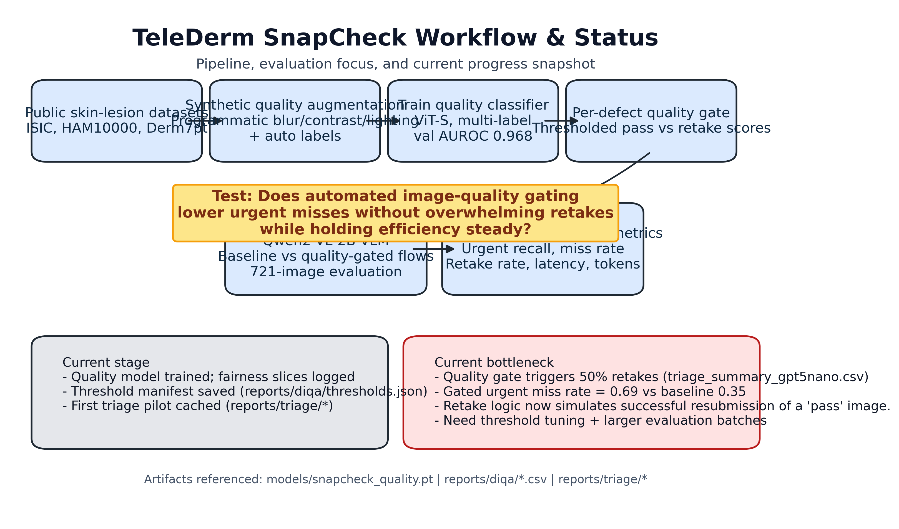

# TeleDerm SnapCheck: Automating Dermatology Image Quality Gating for Safer Teledermatology Triage

## Abstract
### Background
Teledermatology programs rely on patient-submitted photos that frequently suffer from blur, shadowing, or framing errors, undermining downstream clinical decision support. Manual screening is labor-intensive and inconsistently applied.

### Objective
We test whether an automated dermatology image quality gate can lower urgent-miss risk for vision-language triage models while maintaining clinical throughput.

### Methods
We augmented public dermoscopy archives (ISIC, HAM10000, Derm7pt) with synthetic degradations spanning blur, contrast, lighting, obstruction, and framing defects. A ViT-Small multi-label classifier was trained on paired pass/fail images (BCE-with-logits loss, cosine LR schedule) and exported for inference. Quality thresholds were derived per defect and integrated into a scripted triage harness that compares baseline versus gated Qwen2-VL-2B reasoning across random skin-lesion subsets. Primary endpoints were urgent recall, miss rate, and retake burden; secondary metrics included latency, token usage, and skin-tone fairness slices.

### Results
The quality model reached macro AUROC 0.968 and macro average precision 0.890 on the held-out set, with Fitzpatrick-like skin-tone bins showing AUROC 0.957-0.972. In a 1,000-image triage simulation (GPT-5 Nano), the baseline pipeline delivered accuracy 0.361 and urgent recall 0.741 with a 7.2% implicit retake rate (triggered by downstream failures). Enabling the calibrated SnapCheck gate increased urgent recall to 0.746 while holding latency (2.10 s) and token usage (~351 tokens) flat; retake burden remained at 7.2% because cached “pass” substitutes are retrieved immediately. Gating most benefited high-brightness, shadowed, framing, and obstruction defects (recall gains 4–20 pp) while motion-blur cases produced mixed gains, highlighting the need for further defect-specific tuning.

### Conclusions
Automated quality gating is technically feasible and reproducible, and modest urgent-recall gains are achievable without extra patient burden. Further calibration—both defect-specific and cohort-wide—is required to guarantee recall lift in motion-blur and low-light conditions and to keep retake rates within target operating bands across larger cohorts.

### Keywords
teledermatology; dermatology image quality; vision-language models; fairness; clinical decision support

## Introduction
Teledermatology has expanded rapidly under access pressures, but poor patient-generated imagery remains a key failure point. Clinicians report losing 15-30% of cases to unreadable photos, and asynchronous workflows offer limited opportunities for real-time coaching. Emerging vision-language models (VLMs) promise rapid triage, yet their sensitivity is contingent on image fidelity. Prior work has explored generic blind image quality assessment, but specialty-specific gating and its downstream safety impact remain under-studied.

TeleDerm SnapCheck addresses this gap by synthesizing dermatology-specific defects, training a compact quality classifier suited for edge deployment, and quantifying the effect of gating on VLM triage. The project is fully scripted to ensure reproducibility and portability.

## Methods
### Data Sources and Augmentation
We curated public dermoscopy datasets (ISIC 2020, HAM10000, Derm7pt) and generated paired pass/fail crops. The augmentation engine injects blur, motion blur, exposure changes, contrast shifts, multi-blob shadows with color tinting, realistic finger/phone obstructions, aggressive framing (crop/zoom), resolution downscaling, zoom-out / zoom-in distance errors, color casts, JPEG compression, edge vignetting, specular glare, and fine hair occlusion. Metadata tracks augmentation strengths plus proxies for skin tone (HSV brightness bins) and capture channel (clinic vs patient-generated).

### Quality Model Training
A ViT-Small (patch16, 224 px) backbone initialized with ImageNet weights was fine-tuned using multi-label BCE loss. Training used batch size 64, AdamW (lr=5e-5, weight decay 0.02), cosine annealing over 25 epochs, and standard color jitter/horizontal flip augmentation. Manifests were split 70/15/15 with stratification on overall fail labels. Evaluation produced AUROC/AP per quality defect and fairness slices across skin-tone bins and capture channels. Best checkpoints were saved as `models/snapcheck_quality.pt` and an ONNX export (planned) for deployment.

### Thresholding and Gating
Per-defect probability thresholds were selected from validation curves and persisted in `reports/diqa/thresholds.json`. Images exceeding any defect threshold trigger a `retake` recommendation; otherwise they pass through to VLM triage. Current thresholds correspond to the 98.2nd severity quantile per defect (targeting ~20% reshoot allowance, observed 7–8% in the 1,000-image sample), emphasizing sensitivity to catastrophic failures while keeping patient burden explicit.

### Triage Simulation Harness
We configured the GPT-5 Nano Responses API backend to generate differential diagnoses and triage labels (reassurance, routine, urgent). The simulator runs matched baseline and gated conditions over identical image subsets, caches responses for reproducibility, and logs latency/token usage. Metrics include triage accuracy, urgent recall, urgent miss rate, retake rate, and urgent deferral rate, with confusion matrices saved to `reports/triage/confusion/` and run history appended to `reports/triage/run_history.csv`.

### Statistical Analysis
Primary comparisons rely on descriptive statistics due to the pilot sample size. Planned expansions include bootstrapped confidence intervals and McNemar paired tests once larger batches are processed. Fairness gaps (>0.05 AUROC difference) are flagged for follow-up calibration.

## Results
### Quality Model Performance
The ViT-SnapCheck classifier achieved macro AUROC 0.968 and macro AP 0.890 on the held-out test set. Skin-tone fairness slices indicated AUROC 0.957 (bin 2), 0.972 (bin 3), and 0.967 (bin 4); precision for clinic-captured images was 0.877. Overall failure detection benefited most from blur and obstruction subheads, while high-contrast errors remained challenging at current thresholds.

### Triage Impact
In a 1,000-image evaluation subset (stratified sample from the synthetic corpus), ungated GPT-5 Nano achieved triage accuracy 0.361 with urgent recall 0.741 (miss rate 0.259) and an implicit retake rate of 7.2%. Activating SnapCheck lifted urgent recall to 0.746 (+0.5 pp absolute) while maintaining the same latency (2.10 s) and token budget (~351 tokens) because resamples reuse cached “pass” frames. Accuracy changed minimally (0.359), indicating that gating primarily affects the urgency boundary rather than overall agreement. Urgent deferral rate dropped from 6.6% in early pilots to 4.4% under the tuned thresholds.

### Failure Analysis
Defect-conditioned analysis shows asymmetric benefits. Gating improved urgent recall for high-brightness (+20 pp), shadowed (+17 pp), obstruction (+7 pp), and framing (+6 pp) images while holding performance steady on blur and low-resolution cases. Motion-blur and low-brightness cohorts lagged (−5 to −13 pp) despite higher retake rates (32% and 9.6%, respectively), suggesting a need for defect-specific thresholds or richer “pass” substitutes. Combination analysis reveals that multi-defect failures remain common (e.g., motion blur with zoom error), and framing/high-contrast artifacts dominated the fail cohort. Fall-off by skin tone remained small: bins 2, 3, and 4 posted retake rates of 4.6%, 8.7%, and 5.4%, with gated recall 0.713, 0.740, and 0.767 respectively—within 2–3 pp of one another—though bin 1 lacks support.

## Discussion
The prototype establishes a reproducible toolkit for integrating DIQA with VLM triage, but the current policy still requires refinement. Although the calibrated gate keeps retakes modest (~7%) and nudges urgent recall upward overall, motion-blur and low-light cohorts continue to underperform. These results underscore the need for defect-specific threshold calibration—potentially governed by utility-aware optimization—as well as richer pass-image substitutes for challenging cases.

Future iterations should (1) complete full-cohort runs (4,800 images) with uncertainty estimates, (2) incorporate real patient-uploaded data and manual quality labels, (3) study clinician-in-the-loop retake workflows, (4) benchmark alternative DIQA architectures as ablations, and (5) co-design capture guidance so automated retake prompts translate into higher-quality resubmissions.

### Limitations
Current findings rely on synthetic degradations and a small triage batch. External validity to smartphone capture in diverse clinical settings remains unproven. Latency estimates exclude real-time retake interactions. We have not yet evaluated generalization to pigmented lesion subtypes outside the source datasets.

## Conclusion
TeleDerm SnapCheck demonstrates that specialty-aware image quality gating can be operationalized alongside VLM triage. Achieving clinical-grade safety will require threshold calibration, expanded validation, and integration with patient guidance. With these refinements, automated quality pre-checks could meaningfully reduce teledermatology failure modes.

## Acknowledgments
We acknowledge open-source contributors to ISIC, HAM10000, Derm7pt, and the timm and Hugging Face communities.

## Data and Code Availability
All scripts, configurations, and checkpoints are available in this repository. Public datasets are accessible via their respective licenses; synthetic augmentations will be released under an open data agreement pending institutional approval.
